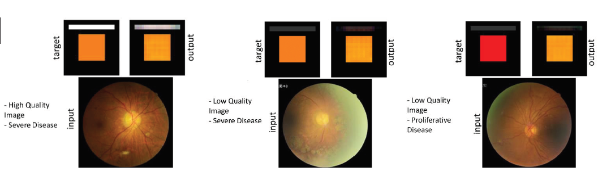

1- download the dataset:  
https://github.com/deepdrdoc/Deep-Diabetic-Retinopathy-Image-Dataset-DeepDRiD-  
only subdirectory _/regular_fundus_images/regular-fundus-training/_ is required.  
Indeed: https://github.com/deepdrdoc/Deep-Diabetic-Retinopathy-Image-Dataset-DeepDRiD-/tree/master/regular_fundus_images/regular-fundus-training 

2- resize all images to 256x256x3 and place them in a folder named "resizedversion_256x256_drid"   
You can use my converter code with MATLAB: _Pr_Resize.m_ . make sure to set the directory path.   

3- Place the folder of 2, in _data_ subdirectory  
Indeed the data subdirectory should contains _resizedversion_256x256_drid_ folder and _data.csv_
4- execute the script:  
> python Pr_Tensorization_v4_color_DeepEnsemble.py

It will produce the results in a folder named "v4_DE"

For more results and case studies, consider ReadME_crossvalidation.
