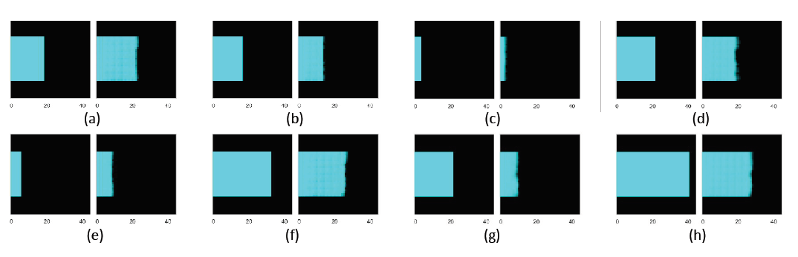

 

 

For this data preparation, the approach shared in the following resource is used: 
https://github.com/daniel-codes/hospital-los-predictor

1- Download MIT MIMIC-III from:  
https://physionet.org/content/mimiciii-demo/1.4/

2- We only need following CSV files and place them in the data folder:  
_ADMISSIONS.csv_  
_DIAGNOSES_ICD.csv_  
_ICUSTAYS.csv_  
_PATIENTS.csv_  

3- execute:
> python Pr_Tensorization_v0.py

