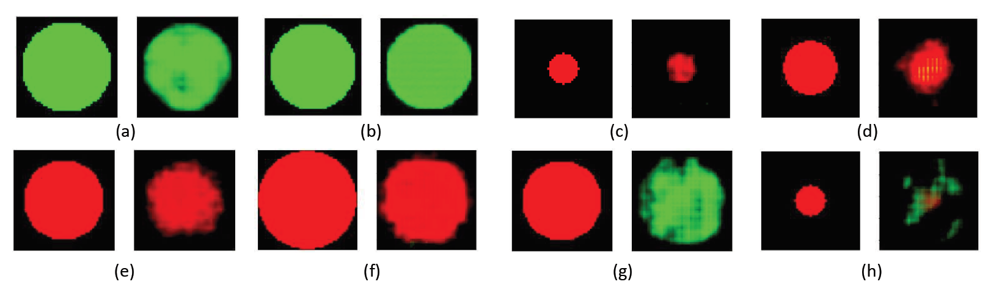

 

 

1- Unzip the prepared data:  
Data_Kaggle_512_Normal.zip  
Data_COVID_resized_selected.zip  

2- run the script:  
> python Pr_Tensorization_Severity.py

It will produce results in a folder named "1"

Notice:  
Notice that the original data is from:  
https://www.kaggle.com/paultimothymooney/chest-xray-pneumonia  
https://github.com/ieee8023/covid-chestxray-dataset  

