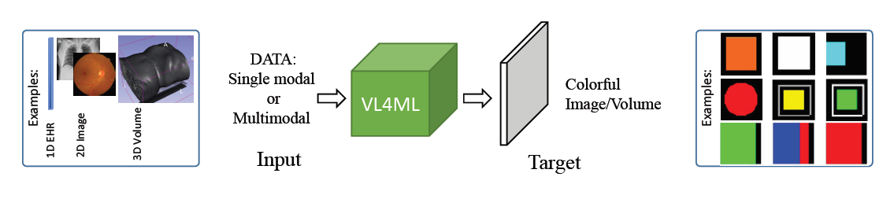

# VL4ML
 Visualized Learnign for Machine Learning

This repository contains the source codes of the experiments mentioned in the paper:

For each experiment there is a subdirectory which you can find the relative codes and readme. The experiments are as follow:

- Classification of the patient survival in Intensive Care Unit (ICU): In this case, the tabular data from electronic health records (EHR) are fed to the network to produce visualized survival status using distinct colors in a 23x23 image. 
- Assessing the Diabetic Retinopathy grade: In this case, the retina Fundus images are used to produce the disease grades by visualizing both intensity values and colors in a 23x23 image.
- Estimating the patient's length-of-stay in a hospital: The EHR data is used here to express visually the length of stay in which the amount of colored columns in a 45x45 image represents the length of stay.
- Assessing the severeness of COVID-19: Chest X-ray data is used and the results expressed through colorful circles, green for healthy state and red for disease state, where severity of disease state is determined by the size of the red circles. 
- Diagnosis and prognosis of Alzheimer's Disease: Multimodal tabular data are fed into the model for producing color-coded AD prediction labels in a colored 23x23 image.

## requirements:

For these experiments, python 3.7 and Keras of Tensorflow 2.9.0 (also 2.4.0) are used.  
You can also consider the requirements.txt

